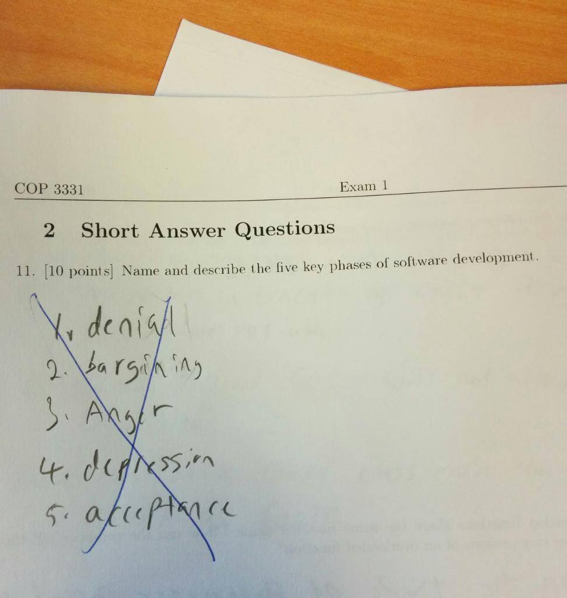

# Syllabus

## Proof of Learn
TBD

## Getting Started

Before you do anything, you'll need to knock out two small tasks. The **first** is [setting up your dev environment](dev-env.md).

<!-- And the **second** is getting your attendance coin wallet, you'll need metamask for this. -->

If any of these terms fly over your head, it's okay, because you'll get to learn each and every single one at your own pace. Just type in the commands and get your dev environment ready. We'll dig into all of that stuff as we move on, and it'll start to make sense. After a lot of crying.

</a>

---
## Section 1

If you've never programmed, check out [this article](https://codeburst.io/the-2018-web-developer-roadmap-826b1b806e8d). Always start small, because you're going to find yourself in a lot of dark rabbit holes and you're going to want breadcrumbs to take you back so you can connect them all like an underground tunnel system. These courses should be enough to get you started.

| Course | Status |
|---|---|
| [Codecademy: HTML](https://www.codecademy.com/learn/learn-html) | |
| [Codecademy: CSS](https://www.codecademy.com/learn/learn-css) | |
| [Codecademy: JavaScript](https://www.codecademy.com/learn/introduction-to-javascript) | |
| [FreeCodeCamp: Responsive Web Design Certificate](https://learn.freecodecamp.org/) | |

Once you move on from that, and have a little more understanding of web development, you should move on to these courses.

| Course | Status |
|---|---|
| [Codecademy: React I](https://www.codecademy.com/learn/react-101) | |
| [Codecademy: React II](https://www.codecademy.com/learn/react-102)| |
| [FreeCodeCamp: JavaScript Algorithms and Data Structures Certification](https://learn.freecodecamp.org)| |

If you've completed all of those or you want more practice, check out [this repo](https://github.com/P1xt/p1xt-guides/blob/master/job-ready-javascript-edition-3.0.md). It features a lot of courses from Khan Academy and complements the certifications from FreeCodeCamp. It also gives you a few more project ideas to complete.

When picking resources to study from, it's best to pick one and see it through to the end. The only time you should switch is when you feel fuzzy on a topic and need to learn it from another perspective. But you should always come back to that first one.

---

## Section 2

### Books

| Mastering Ethereum | Complete? | Test |
|----|----|----|
| [Chapter 1: What Is Ethereum?](https://github.com/ethereumbook/ethereumbook/blob/develop/01what-is.asciidoc) | | Link Here |
| [Chapter 2: Ethereum Basics](https://github.com/ethereumbook/ethereumbook/blob/develop/02intro.asciidoc)| | Link Here |
| [Chapter 3: Ethereum Clients](https://github.com/ethereumbook/ethereumbook/blob/develop/03clients.asciidoc)| | Link Here|
| [Chapter 4: Cryptography](https://github.com/ethereumbook/ethereumbook/blob/develop/04keys-addresses.asciidoc) | | |  
| [Chapter 5: Wallets](https://github.com/ethereumbook/ethereumbook/blob/develop/05wallets.asciidoc) | | |  
| [Chapter 6: Transactions](https://github.com/ethereumbook/ethereumbook/blob/develop/06transactions.asciidoc) | | |  
| [Chapter 7: Smart Contracts and Solidity](https://github.com/ethereumbook/ethereumbook/blob/develop/07smart-contracts-solidity.asciidoc) | | |  
| [Chapter 8: Smart Contracts and Vyper](https://github.com/ethereumbook/ethereumbook/blob/develop/08smart-contracts-vyper.asciidoc) | | |  
| [Chapter 9: Smart Contract Security](https://github.com/ethereumbook/ethereumbook/blob/develop/09smart-contracts-security.asciidoc) | | |  
| [Chapter 10: Tokens](https://github.com/ethereumbook/ethereumbook/blob/develop/10tokens.asciidoc) | | |  
| [Chapter 11: Oracles](https://github.com/ethereumbook/ethereumbook/blob/develop/11oracles.asciidoc) | | |  
| [Chapter 12: Decentralized Applications](https://github.com/ethereumbook/ethereumbook/blob/develop/12dapps.asciidoc) | | |  
| [Chapter 13: The Ethereum Virtual Machine](https://github.com/ethereumbook/ethereumbook/blob/develop/13evm.asciidoc) | | |  
| [Chapter 14: Consensus](https://github.com/ethereumbook/ethereumbook/blob/develop/14consensus.asciidoc) | | |  

[Mastering Ethereum can be purchased on Amazon](https://www.amazon.com/Mastering-Ethereum-Building-Smart-Contracts/dp/1491971940)

### Readings:

| Level | Article | Status | Quiz |
| ---- | ---- | ---- | ---- |
| Beginner | [Programmable Blockchains in Context](https://media.consensys.net/programmable-blockchains-in-context-ethereum-s-future-cd8451eb421e) | | |
| | [Pre-History of the Ethereum Protocol](https://vitalik.ca/2017-09-15-prehistory.html) | | |
| | [Just Enough Bitcoin for Ethereum](https://media.consensys.net/time-sure-does-fly-ed4518792679) | | |
| | [Ethereum: Bitcoin Plus Everything](https://media.consensys.net/time-sure-does-fly-ed4518792679) | | |
| | [Introduction to Ethereum](https://github.com/ethereum/wiki/wiki/Ethereum-introduction) | | |
| | [A Deep Dive on End-to-End Encryption: How Do Public Key Encryption Systems Work?](https://ssd.eff.org/en/module/deep-dive-end-end-encryption-how-do-public-key-encryption-systems-work) | | |
| | [Truffle's Ethereum Overview](https://truffleframework.com/tutorials/ethereum-overview) | | |
| | [Business Model of Crypto Wallets](https://hackernoon.com/the-business-model-of-crypto-wallets-89aeed8322dc) | | |
| | | | |

### Videos:

### Courses:

Free:

Paid:

## Module 2:

- [CryptoZombies Lesson 1](https://cryptozombies.io/en/lesson/1)

- [Block Simulator](https://anders.com/blockchain/block.html)

---

Going forward:
At what point are people instructed to create their first attendance coin wallet?

Assignment suggestions:
1. pick a whitepaper, out of anywhere, digest it, explain it, form an opinion on it. +10 pts if can prove shitcoin.
2. comment out a smart contract to explain what it does?
3. have vocab.mb to keep track of terms AND to practice markdown

Repo Suggestions:
1. Have another branch for submissions, so that's where people will push to have their "tests graded" and ATC awarded.
2. Add a .gitignore
3. change name for
