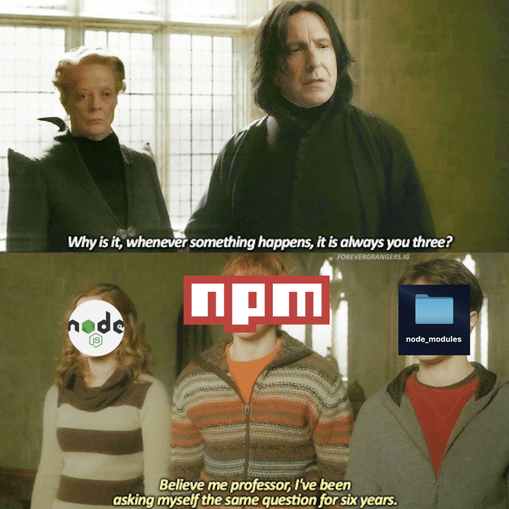

# Setting Up Your Development Environment

## Part One: Staying in The Loop
#### Slack

Slack is where we'll be communicating with each other the most. It's where we discuss our ideas, ask our questions and post our resources. If you haven't already, download **[Slack](https://slack.com/downloads/)**.


... or just use the web version.

Create an account and join our channel **[here](https://stow-protocol-devs.slack.com
)**.

## Part Two: Shilling For Shell
#### Bash
*Fellow imbibers of the Apple-flavored kool-aid, you can skip to right over to [Command Line Interface](#cli).*

Windows users, stay right here, you'll need to install a **[bash shell](https://www.windowscentral.com/how-install-bash-shell-command-line-windows-10)** before you move on. This will make installing different packages, their dependencies... and version control, so much easier. And cooler.

To navigate around, you'll be able to use the same **[commands](https://help.ubuntu.com/community/UsingTheTerminal#Commands)** as you would with Ubuntu.


#### <a name="cli">Command Line Interface</a>

*If you speak command line as a native language, skip to [Part Three](#part-three) where you can install any packages you don't have yet.*

If you haven't ever used a shell, fear not, because you're in for a total treat.

Long ago, before pretty buttons and nice menus were an absolute must-have, or even thought possible, your computer was only capable of inputting and outputting text. You type in the commands, and the computer does what you tell it to do. Because of that, it's described as the window to the heart of the computer-- the heart being the kernel. Now the kernel is the software that knows how to make the hardware do things. So you speak to the kernel to get your computer to... compute.

But if we have pretty buttons and nice menus, why would anyone prefer to use a shell now? It seems a bit primitive, I know. Thousands of man hours dedicated to developing beautiful GUIs, and here we are clacking on a small black screen with green h4ck3r text. But it's way faster to type a command than to click a button. You can run your code straight from the command line, as long as you've got its complementary environment. Make a new directory? `mkdir`. Create a new document? `touch new-document.txt`. Open that directory you just created? `open [name of your directory]`. Force quit an unresponsive application...?

<p align="center">
  <a href="https://medium.com/@eightlimbed/creating-and-killing-processes-in-linux-7d4470f1f7a6"></a>
</p>

`kill` is my favorite command. It's just so colorful.

Here are some courses to help you become one with the command line:
- [Codecademy - Learn the Command Line](https://www.codecademy.com/learn/learn-the-command-line)
- [Django Girls - Intro to the Command Line Interface](https://tutorial.djangogirls.org/en/intro_to_command_line/)
- [Zed Shaw's "LPTHW" also has a Command Line Crash Course](https://learnpythonthehardway.org/book/appendixa.html)

- If you're a Team Treehouse member, [here's their course on the Command Line Interface](https://teamtreehouse.com/library/console-foundations).

## <a name="part-three">Part Three: Packages</a>

#### Brew 🍺

*If you're part of the PC Master Race, skip down to [Git](#git). This is OSX sorcery.*

[What is Brew?](https://brew.sh/) Brew is short for Homebrew 🍺, it's a free and open source package management system that you use to install packages, and you only have it on Mac OSX. What a mouthful, here, check out [this link](https://computers.tutsplus.com/tutorials/homebrew-demystified-os-xs-ultimate-package-manager--mac-44884). It explains brew 🍺  works as a package manager.

To install brew, copy this command and paste it in terminal.
```unix
/usr/bin/ruby -e "$(curl -fsSL https://raw.githubusercontent.com/Homebrew/install/master/install)"
```

You can update brew with... wait for it... `brew update`.

#### <a name="git">Git</a>

[What is Git?](https://git-scm.com/downloads) It's just a form of tracking changes to your code.


If you were ever guilty of creating a new save file for every change you ever made on a file. It's like that, but more organized. Version control is incredibly important when you want to keep track of every version of a file you've ever created. The heavens forbid, you end up like Snapchat with their series of unfortunate UI updates, only to be met by confused users **begging** for the older version back! Worse comes to worst, if a new function breaks your code, you can always go back to a past version. Oh, and you can collaborate with other people on your code. Or theirs. And this is where open source contributions come from.

The neat thing about git is that you can use it either with the command line interface, or you can download an app with a GUI so you can see what branching and merging actually looks like.

[Installation](https://git-scm.com/book/en/v2/Getting-Started-Installing-Git) could be done straight from the command line.

Mac users, you have two options to choose from:
- If you have Mavericks 10.9 or higher, Git is already built in, you just need to install XCode's CLI tools by typing in `xcode-select --install`, and then `git --version`.

- If you want to use brew 🍺, just type in `brew install git`.

All this talk about git, but where do your file changes go? To [GitHub](github.com). So you'll need to make an account there. But wait, how do you configure git on your computer, locally, to connect to your GitHub account? Superduper simple.

To configure your username, type in
```unix
git config --global user.name "FirstName LastName"
```
Then, type in
```unix
git config --global user.email "email@example.com"
```

If you went ahead and enabled 2FA, like you should, you might encounter a little hiccup. You wanted to push, it asked for your password, but your authentication failed. You can fix this and configure your account securely by creating a **personal access token**. When it asks for your password, enter in the token generated. [This article](https://medium.com/@ginnyfahs/github-error-authentication-failed-from-command-line-3a545bfd0ca8) will help.

**Apple User Update (December 2nd, 2018)**: I've updated to OSX Mojave and it broke Git. I got this beautiful error when I tried cloning a repo:
```unix
xcrun: error: invalid active developer path (/Library/Developer/CommandLineTools), missing xcrun at: /Library/Developer/CommandLineTools/usr/bin/xcrun
```

You fix this by sacrificing a Windows user to the XCode gods while reciting this ancient incantation dating back to POSIX Time:
[`xcode-select --install`](https://stackoverflow.com/questions/52522565/git-is-not-working-after-macos-mojave-update-xcrun-error-invalid-active-devel). Git should work after that.

### Node.js and NPM

[Node.js](https://nodejs.org/en/) is a popular... no, no, no. Okay, how do I do this. It's a JavaScript environment that has been memed to the be [**only real dev language**](https://www.youtube.com/watch?v=ame2PH67gnk). Whatever that means. If that video broke your brain, great, we can pick the pieces up together and learn it the right way, even if r/programmerhumor [makes fun of it](https://www.reddit.com/r/ProgrammerHumor/comments/9pu2dc/java_node/). [This](https://codeburst.io/the-only-nodejs-introduction-youll-ever-need-d969a47ef219) article is a great primer on Node.js.


FreeCodeCamp has a [course](https://learn.freecodecamp.org/apis-and-microservices/basic-node-and-express/meet-the-node-console) for it. As does [w3shools](https://www.w3schools.com/nodejs/),

Some recommended, but not free.99, Udemy courses can be found in [this](https://medium.com/quick-code/the-best-tutorials-to-learn-node-js-34818d757013) article.
If you have a Team Treehouse membership, here's their course on [Node.js Basics](https://teamtreehouse.com/library/nodejs-basics-2).

Then you have NPM.
NPM in progress.

<!-- You can't have [Node.js](https://nodejs.org/en/) without [NPM](https://www.npmjs.com/), so they get installed together. -->


## IDE:
If you're using either Sublime or Atom, here are a few helpful commands and packages to install.

### Markdown
---

Once you get the hang of how github works, you'll see that people often use documentation

## Part Five:
### Ganache

### Truffle

### Parity
